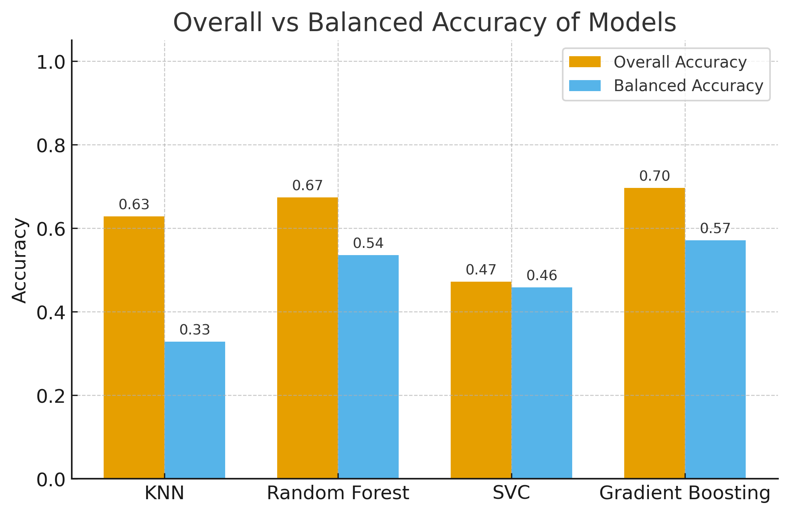

# 🧬 Probe Classification with Machine Learning

This project applies **machine learning** to analyze sequence alignment statistics and identify optimal probe candidates.

### Supervised models
KNN, Random Forest, SVC, and Gradient Boosting

### Unsupervised clustering
KMeans to explore natural structure in probe features

### Metrics
Balanced accuracy, macro F1, confusion matrices, PCA projections

✨ **Key result**  
Gradient Boosting achieves **~70% overall accuracy** (balanced accuracy = 0.57, macro F1 = 0.52), successfully classifying high-recovery probes and partially detecting low-recovery cases. This demonstrates the feasibility of a data-driven approach for probe design, with clear potential for improvement through optimization and additional data.

## 📈 Model Performance

